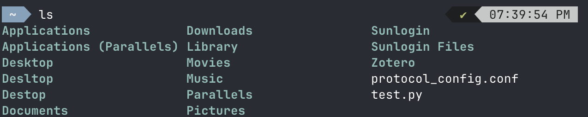
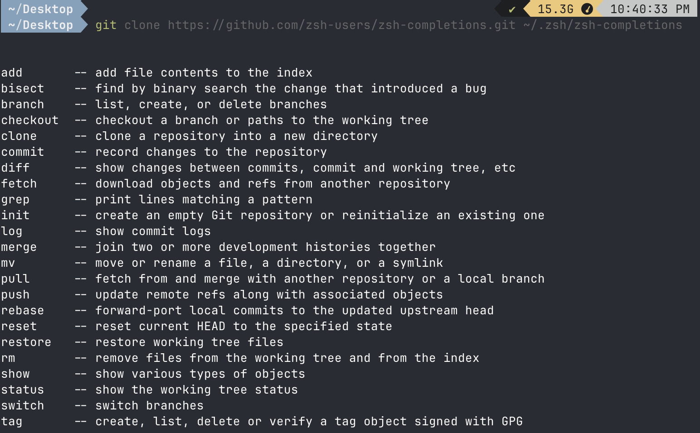
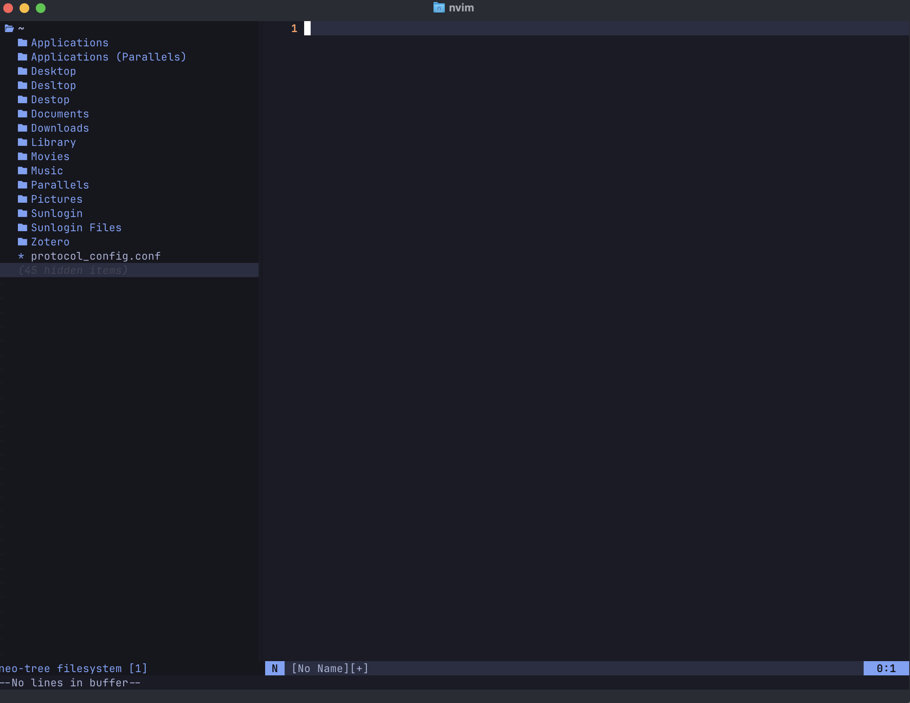

最近想试一试从vs code切换到vim，简单介绍一下从Mac安装neovim及其插件的过程

## ghostty

这个终端也不错，比较简洁,最后采用了这个终端

新的终端linux没集成，ssh的时候需要设置一下环境变量(TERM=xterm-256color)
<https://ghostty.org/docs/help/terminfo>

```raw
快捷键：
# 移动
super+up arrow: 向上滚动至上一行命令
super+down arrow: 向下滚动至下一行命令
super+page_up: 向上翻页。
super+page_down: 向下翻页。
super+home: 滚动到顶部
super+end: 滚动到底部
option+left mouse：在命令中移动指针

# 窗口管理
super+t: 新建标签页
super+n: 新建窗口
super+w: 关闭当前（标签页或分割窗口）
super+Shift+W：关闭窗口

super+enter: 切换全屏模式

super+d: 在右侧新建分割窗口
super+shift+d: 在下方新建分割窗口
super+alt+方向键：切换窗口
super+ctrl+方向键: 调整分割窗口大小
super+ctrl+equal: 使分割窗口大小相等

super+number:切换到对应的tab

# 大小调整
super+equal: 增加字体大小
super+minus: 减小字体大小
super+zero: 重置字体大小

```

`brew install ghostty`

## tldr

我们再安装一个命令备忘录插件tldr

The tldr pages are a community effort to simplify the beloved man pages with practical examples.

`brew install tldr`

> Then you have direct access to simplified, easy-to-read help for commands, such as tar, accessible through typing tldr tar instead of the standard man tar.

使用很简单：tldr就行

## oh my zsh

>Oh My Zsh is a delightful, open source, community-driven framework for managing your Zsh configuration. It comes bundled with thousands of helpful functions, helpers, plugins, themes, and a few things that make you shout...

install:

```zsh
sh -c "$(curl -fsSL https://raw.githubusercontent.com/ohmyzsh/ohmyzsh/master/tools/install.sh)"
```

theme:choose powerlevel10k
>Powerlevel10k is a theme for Zsh. It emphasizes speed, flexibility and out-of-the-box experience.

install:

```zsh
git clone --depth=1 https://github.com/romkatv/powerlevel10k.git ${ZSH_CUSTOM:-$HOME/.oh-my-zsh/custom}/themes/powerlevel10k
change ~/.zshrc to ZSH_THEME="powerlevel10k/powerlevel10k"
```



如果需要额外配置可以修改`~/.zshrc`和`~/.p10kzsh`

接下来我们安装3个zsh插件

```shell
- zsh-syntax-highlighting
git clone https://github.com/zsh-users/zsh-syntax-highlighting.git ~/.zsh/zsh-syntax-highlighting
echo "source ~/.zsh/zsh-syntax-highlighting/zsh-syntax-highlighting.zsh" >> ${ZDOTDIR:-$HOME}/.zshrc
- zsh-autosuggestions
git clone https://github.com/zsh-users/zsh-autosuggestions ~/.zsh/zsh-autosuggestions
echo "source ~/.zsh/zsh-autosuggestions/zsh-autosuggestions.zsh" >> ${ZDOTDIR:-$HOME}/.zshrc
- zsh-completions
git clone https://github.com/zsh-users/zsh-completions.git ~/.zsh/zsh-completions
echo "source ~/.zsh/zsh-completions/zsh-completions.plugin.zsh" >> ${ZDOTDIR:-$HOME}/.zshrc

```




到这里，我们前期的shell配置就配置好啦！


## neovim

> Neovim is a refactor, and sometimes redactor, in the tradition of Vim (which itself derives from Stevie). It is not a rewrite but a continuation and extension of Vim. Many clones and derivatives exist, some very clever—but none are Vim. Neovim is built for users who want the good parts of Vim, and more.

install:`brew install neovim`


进入nvim,:Tutor会有一个不错的教程哦


这里使用`https://github.com/nvim-lua/kickstart.nvim`作为初始配置
按照readme安装好配置


nvim进入nvim,就会自动安装配置的插件了，我们也有一个基础的配置了，这些配置在init.lua中。




撒花！
