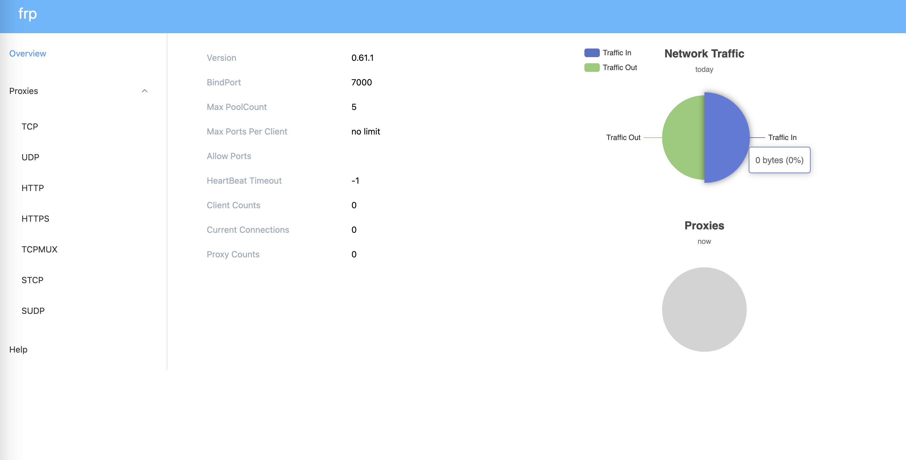
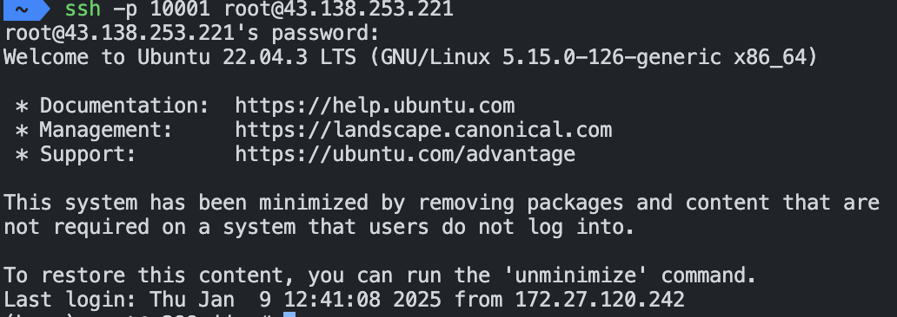
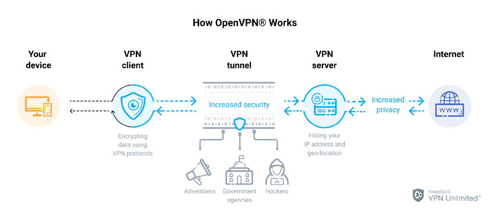

寒假回家，需要访问校园网内的服务器怎么办呢？

目前可行的方法是通过学校提供的easyconnect软件进行流量转发,使用的应该是ssh隧道，但是每次使用都要登陆以及随机验证码验证，十分不方便，而且休眠后连接就会终端。

个人设备：

- 内网服务器一台，无公网ip，配置了ssh服务
- 内网主机一台，无公网ip，配置了todesk远程桌面
- 外网笔记本一台，无公网ip
- 云服务器一台，有公网ip

经过调研，可行的方案：

1. 通过内网穿透（如frp），反向代理到云服务器，外网笔记本访问云服务器去访问内网服务器[^1]
2. 通过ssh反向代理

## 方案一

### 内网穿透

这里采用开源的内网穿透工具frp：<https://github.com/fatedier/frp>

参考示例：<https://gofrp.org/zh-cn/docs/examples/ssh/>

> frp 是一款高性能的反向代理应用，专注于内网穿透。它支持多种协议，包括 TCP、UDP、HTTP、HTTPS 等，并且具备 P2P 通信功能。使用 frp，您可以安全、便捷地将内网服务暴露到公网，通过拥有公网 IP 的节点进行中转。


这里也可以使用ssh反向代理进行内网穿透，但是其连接有不稳定的风险，需要定时重启，麻烦。暂时不考虑


#### frp在云服务器配置


记得云服务器设置安全组，开启端口哦。开启后可以telnet检查一下是否可以tcp连接开启的端口


在这里下载二进制版本：<https://github.com/fatedier/frp/releases>

- <https://github.com/fatedier/frp/releases/download/v0.61.1/frp_0.61.1_linux_amd64.tar.gz>
- <https://github.com/fatedier/frp/releases/download/v0.61.1/frp_0.61.1_windows_amd64.zip>

解压下载的压缩包。
将 frpc 复制到内网服务所在的机器上。
将 frps 复制到拥有公网 IP 地址的机器上，并将它们放在任意目录。

开始使用:

- 编写配置文件，目前支持的文件格式包括 TOML/YAML/JSON，旧的 INI 格式仍然支持，但已经不再推荐。
- 使用以下命令启动服务器：./frps -c ./frps.toml。
- 使用以下命令启动客户端：./frpc -c ./frpc.toml。
- 如果需要在后台长期运行，建议结合其他工具，如 systemd 和 supervisor。

配置frps.toml

```toml
bindPort = 7000 # 必用：frp的默认监听端口

# 默认为 127.0.0.1，如果需要公网访问，需要修改为 0.0.0.0。
webServer.addr = "0.0.0.0"
webServer.port = 7001
# dashboard 用户名密码，可选，默认为空
# webServer.user = "xxx"
# webServer.password = "xxx"

auth.method = "token" #指定认证方式，token 表示客户端和服务端通过 Token 进行身份认证
auth.token = "xxx" #Token 用于客户端和服务端的身份认证，自由设置

```

可以在配置的端口看dashboard啦，客户端就配置好啦



#### frp在内网服务器配置


这里在服务器和个人电脑上配置都可以，因为是一个子网


配置./frpc.toml

```toml
serverAddr = "xxxx"
serverPort = 7000
auth.method = "token"
auth.token = "xxx"

[[proxies]]
name = "test-tcp"
type = "tcp"
localIP = "127.0.0.1"
localPort = 12000
remotePort = 12000
```

经过测试这套配置我在家是可以穿透的，但是不知道为什么在校园网无法内网穿透，报错，

```raw
PS C:\Users\37359\Downloads\frp_0.61.1_windows_amd64 .\frpc.exe -c .\frpc.toml
2025-01-09 19:51:21.685 [I] [sub/root.go:142] start frpc service for config file [.\frpc.toml]
2025-01-09 19:51:21.699 [I] [client/service.go:295] try to connect to server...
2025-01-09 19:51:31.735 [W] [client/service.go:298] connect to server error: i/o deadline reached
2025-01-09 19:51:31.735 [I] [sub/root.go:160] frpc service for config file [.\frpc.toml] stopped
login to the server failed: i/o deadline reached. With loginFailExit enabled, no additional retries will be attempted
```

在服务端也是没有log连接请求的，应该是校园网拦截了这个tcp链接，这个问题折腾了我很久。

- 默认是启用了tls的，但是没有效果
- 考虑使用KCP协议
- 考虑使用QUIC协议

发现这两种协议可以成功！

更新后的配置：

```toml
# frps.toml
bindPort = 7000 # 必用：frp的默认监听端口
# kcp 绑定的是 UDP 端口，可以和 bindPort 一样,kcp quic二选一
# kcpBindPort = 7000
quicBindPort = 7000

# 默认为 127.0.0.1，如果需要公网访问，需要修改为 0.0.0.0。
webServer.addr = "0.0.0.0"
webServer.port = 7001
# dashboard 用户名密码，可选，默认为空
webServer.user = "xxx"
webServer.password = "xxx"

auth.method = "token" #指定认证方式，token 表示客户端和服务端通过 Token 进行身份认证
auth.token = "xx" #Token 用于客户端和服务端的身份认证，自由设置

--------------------------

# frpc.toml
serverAddr = "x.x.x.x"
serverPort = 7000
auth.method = "token"
auth.token = "xx"
transport.protocol = "quic"
# 开启客户端ui
webServer.addr = "127.0.0.1"
webServer.port = 7002
webServer.user = "xxx"
webServer.password = "xxx"

[[proxies]] # 转发admin_ui
name = "admin_ui"
type = "tcp"
localPort = 7002
remotePort = 7002

[[proxies]] # forward remote port 10000 to x299 port 22
name = "ssh22"
type = "tcp"
localIP = "172.18.216.209"
localPort = 22
remotePort = 10000

# add as you need
```


frps.toml 和 frpc.toml 中
tcpMux默认已开启


#### 通过SSH访问内网机器

```zsh
ssh -p <remotePort> user@x.x.x.x
```

让我们测试一下吧！



成功！

### 使用 systemd

此示例演示如何在 Linux 系统下使用 systemd 来管理 frps 服务，包括启动、停止、配置后台运行和设置开机自启动。

```raw
# 安装 systemd
apt install systemd
# 创建 frps.service 文件
sudo vim /etc/systemd/system/frps.service

# 写入内容
[Service]
Type = simple
# 启动frps的命令，需修改为您的frps的安装路径
ExecStart = /home/lpt/frps -c /home/lpt/frps.toml

[Install]
WantedBy = multi-user.target

[Unit]
# 服务名称，可自定义
Description = frp server
After = network.target syslog.target
Wants = network.target

--------------------------

# 使用 systemd 命令管理 frps 服务
# 启动frp
sudo systemctl start frps
# 停止frp
sudo systemctl stop frps
# 重启frp
sudo systemctl restart frps
# 查看frp状态
sudo systemctl status frps

# 设置 frps 开机自启动
sudo systemctl enable frps
```

### ui更改配置，直接使用

可以打开

- x.x.x.x:7001 查看链接情况
- x.x.x.x:7002 修改客户端配置，保存完成后即可使用

[^1]:<https://gofrp.org/zh-cn/docs/features/common/load-balancer/>

### 注意:安全性问题

可能安全上有一些问题，公司学校服务器还是谨慎使用，需要提升安全性。不要使用公司提供的frp服务，可能通过域名特点识别是frp从而进行爆破。


<https://github.com/fatedier/frp/issues/2860>

releases下载的frp是安全的，所以可能有以下原因

- 你申请的服务器密码被爆破
- 学校行为管理识别出了frp的流量
- ~非releases下载的frp，已被植入病毒~
- ~服务器内其他软件发起的攻击~

解决：

1. 公网机限制
如果使用了FRP，可以在公网机上使用fail2ban、或者防火墙之类的，禁止国外的IP以及不停重复请求的IP。

2. pubkey登录
如果不想花钱的话，就只能使用pubkey登录了，pubkey确实要更安全一些。

3. 再套上一层VPN



#### 提升安全性 Frp+OpenVPN



区别：

- 公网云服务器：运行 FRP 服务端
- 实验室内网服务器：运行 FRP 客户端、**安装 OpenVPN**
- 外网计算机设备：**安装 OpenVPN** 进行连接

配置frp过程类似

安装open vpn: https://github.com/angristan/openvpn-install