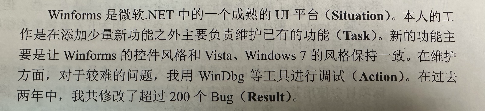

## 面试

### 简历准备

简历：
- 项目经历：STAR原则描述

<figure style="text-align: center;">
    
    <figcaption>STAR原则</figcaption>
</figure>

- 掌握的技能

了解/熟悉/精通

不建议列出了解的技能，除非相关。主要部分应该是熟悉，慎用精通。

### 技术面试

面试官关注的能力
- 基础知识
- 高质量代码，鲁棒：写代码前想好测试用例，不要着急提交给面试官
- 分析问题思路清晰：解决复杂问题的技巧，如画图，举例，分解
- 可以优化算法的效率
- 沟通能力，发散思维，迁移问题，自学能力

### 应聘者提问

注意：
- 不要问和职位无关的问题
- 不要问薪水
- 不要打听面试结果
- 可以从网上搜集的信息以及面试官说过的话找提问的出发点