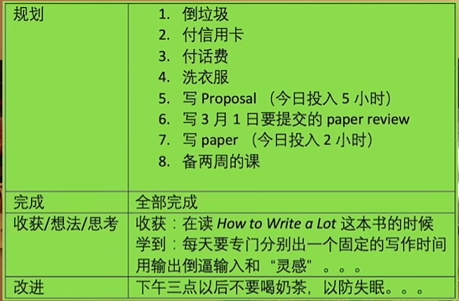
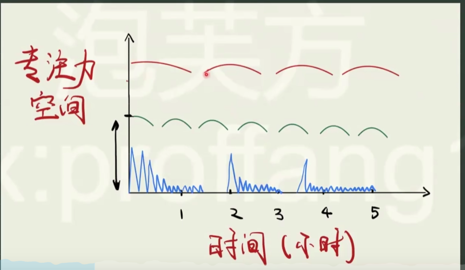

今天看了一个b站的视频，名字叫做`为什么成功人士从来不写待办清单`，也分享给大家，其中**以结果为导向**的概念对我感触非常大。

为什么要写这篇博客？因为我对自己的生活状态不满意，想要的很多，计划了很多，却往往虎头蛇尾，失去了很多机会。表现如下：

- 计划的事经常**选择性拖延**，却又用肤浅的娱乐麻痹自己内心的自责。无所事事，导致心理压力。
- **期望太完美**，害怕做错，开始去做就成了很大的压力。但是做一件事，不管做的是否完美，开始去做总是最重要的。
- 做事的时候**不专注**，容易分心，时间利用率低，一不留神就刷起手机b站了，每天有效工作的时间很少。

如何打破这个困扰了我数年的生活习惯？无法改变的话，我的梦想永远不可能实现。我一定要改变自己的习惯，不但学习上能取得进展，且是以与生活良好协调的方式达成的！以下是我需要着重改进的几个方面：

## 定计划

如何看待做计划：

- 以结果为导向，不要过分担心不充分不完美。而大部分拖延症人群或未达目标人群往往就是因为**过高的标准而难以马上采取行动**。结果有一年的大目标，也有一个星期的小目标。
- 手续型的代办低关注度，对个人成长无帮助
- 定期复盘，是否在朝目标前进？有更好的办法吗？使思维方式习惯地处于一种运动的，发展的，主动的状态，甚至不用去刻意做计划，也能做的很棒!

如何做计划：

1. 把代办清单分成两类，对自己目标有直接帮助的（一天一件，最多两件）；手续型的无关任务。每周的任务形成一个周目标池子，每天计划从里取完成。

<figure style="text-align: center;">
    
    <figcaption>日计划</figcaption>
</figure>

2. 每天**复盘**任务完成情况。同时**记录专注核心目标**的时间，一天可能就5个小时，可以正字记录，每30分钟画一笔。

<figure style="text-align: center;">
    
    <figcaption>日计划复盘</figcaption>
</figure>

## 训练专注力

- 概念1：注意力空间

<figure style="text-align: center;">
    
    <figcaption>注意力空间</figcaption>
</figure>

蓝色：未刻意专注
绿色：专注练习14天
红色：专注3月以上

**专注核心：有意识地觉察自己的注意力空间，只允许许可的内容进入**

- 概念2：注意力残留
切换注意力时，会有之前任务的注意力残留，**大多数人专注力空间是一个垃圾场**。所以不要让无关的信息占据你的注意力空间。

- 训练注意力练习：

1. 练习**觉察**，10分钟听别人说话，10分钟后暂停1分钟，回顾自己听到的内容
2. 闭眼感知自己的手掌：感觉温度；触感；心跳的跳动。**冥想，心流的状态**
3. **记忆力**训练：嘴巴说，脑子想图像，快速刷数字（记忆空间）
如1笔 2鸭子 3耳朵 4红旗 5钩子 6手枪 7镰刀 8甜甜圈 9猫 10高尔夫球

## 参考

- <https://www.bilibili.com/video/BV1Ku4m1u71p>
- <https://www.bilibili.com/video/BV1Ku4m1u71p>
- <https://www.bilibili.com/video/BV1CT411u7yC>
