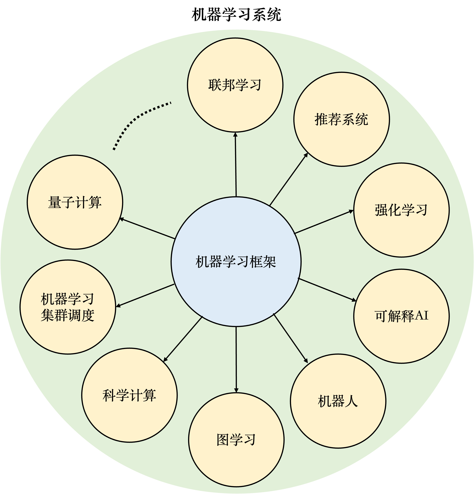
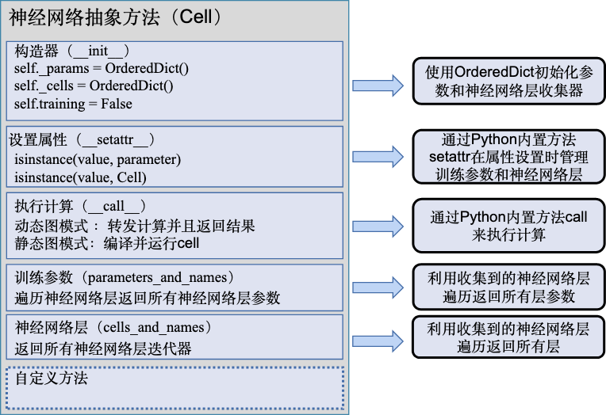

本文章是对开源书籍[OPEN MLSYS](https://openmlsys.github.io/)的笔记与思考

## 简介

机器学习框架的目标

- 神经网络编程（定义网络结构）
- 自动微分
- 数据处理
- 模型训练部署
- 硬件加速
- 分布式环境

机器学习框架的基本组成

<figure style="text-align: center;">
    
    <figcaption>ml framework</figcaption>
</figure>

编程接口: 高层次编程语言（如Python）为主的编程接口。低层次编程语言（如C和C++）为主的系统实现，从而实现操作系统（如线程管理和网络通讯等）和各类型硬件加速器的高效使用。

计算图： 利用不同编程接口实现的机器学习程序需要共享一个运行后端。实现这一后端的关键技术是计算图技术。计算图定义了用户的机器学习程序，其包含大量表达计算操作的算子节点（Operator Node），以及表达算子之间计算依赖的边（Edge）。IR形式

编译器前端： AI编译器来构建计算图，并将计算图转换为硬件可以执行的程序。这个编译器首先会利用一系列编译器前端技术实现对程序的分析和优化。编译器前端的关键功能包括实现中间表示、自动微分、类型推导和静态分析等。

编译器后端和运行时： 完成计算图的分析和优化后，机器学习框架进一步利用编译器后端和运行时实现针对不同底层硬件的优化。常见的优化技术包括分析硬件的L2/L3缓存大小和指令流水线长度，优化算子的选择或者调度顺序。

分布式训练： 各种并行方法及其实现

以**机器学习框架为核心**，人工智能社区创造出了庞大的机器学习系统生态。广义来说，机器学习系统是指实现和支持机器学习应用的各类型软硬件系统的泛称。

<figure style="text-align: center;">
    
    <figcaption>各类MLSYS</figcaption>
</figure>

## 编程接口

### 抽象编程接口设计

抽象编程接口设计（以mindspore.nn.Cell为例，类似torch.nn.Module）

作用：将神经网络层抽象出一个基类，所有的神经网络层都继承基类来实现

- 子类可以是层结构
- 也可以是模型结构（层链接）

功能：初始化训练参数、管理参数状态以及定义计算过程

<figure style="text-align: center;">
    
    <figcaption>mindspore.nn.Cell简要</figcaption>
</figure>

### C/C++编程接口

实现一个GPU算子：

- Primitive注册：在抽象借口这一层注册算子原语，实现初始化，校验输入输出等
- GPU Kernel实现：在C语言后端层次，实现算子逻辑，继承GpuKernel类
- GPU Kernel注册：将GPU Kernel及必要信息注册给框架，由框架完成对GPU Kernel的调用，实例化GPU Kernel class模板类。

### 函数式编程

>从主流的机器学习框架发展历程来看，未来机器学习框架函数式编程风格将会日益得到应用，因为函数式编程能更直观地表达机器学习模型，同时对于自动微分、高阶求导、分布式实现也更加方便。另一方面，未来的机器学习框架在前端接口层次也趋向于分层解耦，其设计不直接为了机器学习场景，而是只提供高性能的科学计算和自动微分算子，更高层次的应用如机器学习模型开发则是通过封装这些高性能算子实现。

机器学习编程的未来方向，不管是JAX、MindSpore还是functorch都提到了函数式编程。

核心思想是函数式编程，一个函数必须是纯函数：计算输出结果时只能使用函数参数里面的数据，不能使用函数以外的数据。这样的纯函数也叫做无状态函数。具体到神经网络的训练过程，就是说一个函数只能使用函数参数及内部创建的张量，不能使用函数外部的张量。

其实函数式与非函数式编程之间的隔阂并不大，把一个有状态的函数的状态也作为函数的参数，新的函数就是没有状态的纯函数了。

例如`y=model(x)`就不是无状态的，因为model包含了函数参数，应该修改为`y=model(x,params)`
