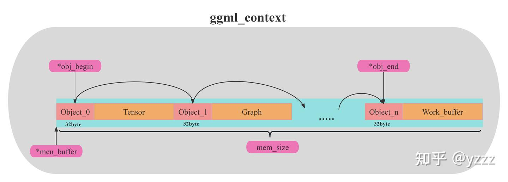

## ggml

ggml是一个用 C 和 C++ 编写、专注于 Transformer 架构模型推理的机器学习库，ggml相当于c++版的pytroch。llama.cpp底层推理采用该库。
可以理解成它主要干了这个事`result = torch.matmul(matrix1, matrix2.T)`

关键概念：

- ggml_context: 一个装载各类对象 (如张量、计算图、其他数据) 的“容器”。

  对于ggml框架来说，无论要做什么（建立modle模型、建立计算图、还是创建承载计算结果的result）都需要先创建一个context作为容器，并将创建的结构体保存在context里（不包括实际数据本身，数据通过结构体里的指针索引）。实际数据的存储位置是由sched调度器与backend buffer后端缓冲所管理存放的

  所以在后续的计算中，我们只需要拿到ctx，就能拿到所有的信息列表，然后经过查找，就可以得到实际数据的存储指针、数据类型等信息。

  

- ggml_cgraph: 计算图的表示，可以理解为将要传给后端的“计算执行顺序”。
- ggml_tensor：ggml版的tensor表示，与pytorch类似，数据存储在data指针变量里;op保存在op指针里
- ggml_backend_t // the backend to perform the computation (CPU, CUDA, METAL)
- ggml_backend_buffer_t buffer; // the backend buffer to storage the tensors data

  在ggml框架中，一切数据（context、dataset、tensor...）都应该被存放在buffer中。之所以要用buffer进行集成，是为了便于实现多种后端（CPU、GPU）内存的统一管理。buffer是实现不同类型数据在多种类型后端上进行统一的接口对象。

  ggml_backend_buffer_t表示通过应后端backend通过分配的内存空间。需要注意的是，一个缓存可以存储多个张量数据。

要在CPU上完成上述矩阵乘法，步骤如下：

- 分配一个 ggml_context 对象来存储张量数据
- 分配张量并赋值
- 为矩阵乘法运算创建一个 ggml_cgraph
- 执行计算
- 获取计算结果
- 释放内存并退出

<details>

<summary>code</summary>

```c
#include "ggml.h"
#include "ggml-cpu.h"
#include <string.h>
#include <stdio.h>

int main(void) {
    // initialize data of matrices to perform matrix multiplication
    const int rows_A = 4, cols_A = 2;
    float matrix_A[rows_A * cols_A] = {
        2, 8,
        5, 1,
        4, 2,
        8, 6
    };
    const int rows_B = 3, cols_B = 2;
    float matrix_B[rows_B * cols_B] = {
        10, 5,
        9, 9,
        5, 4
    };

    // 1. Allocate `ggml_context` to store tensor data
    // Calculate the size needed to allocate
    size_t ctx_size = 0;
    ctx_size += rows_A * cols_A * ggml_type_size(GGML_TYPE_F32); // tensor a
    ctx_size += rows_B * cols_B * ggml_type_size(GGML_TYPE_F32); // tensor b
    ctx_size += rows_A * rows_B * ggml_type_size(GGML_TYPE_F32); // result
    ctx_size += 3 * ggml_tensor_overhead(); // metadata for 3 tensors
    ctx_size += ggml_graph_overhead(); // compute graph
    ctx_size += 1024; // some overhead (exact calculation omitted for simplicity)

    // Allocate `ggml_context` to store tensor data
    struct ggml_init_params params = {
        /*.mem_size =*/ ctx_size,
        /*.mem_buffer =*/ NULL,
        /*.no_alloc =*/ false,
    };
    struct ggml_context * ctx = ggml_init(params);

    // 2. Create tensors and set data
    struct ggml_tensor * tensor_a = ggml_new_tensor_2d(ctx, GGML_TYPE_F32, cols_A, rows_A);
    struct ggml_tensor * tensor_b = ggml_new_tensor_2d(ctx, GGML_TYPE_F32, cols_B, rows_B);
    memcpy(tensor_a->data, matrix_A, ggml_nbytes(tensor_a));
    memcpy(tensor_b->data, matrix_B, ggml_nbytes(tensor_b));


    // 3. Create a `ggml_cgraph` for mul_mat operation
    struct ggml_cgraph * gf = ggml_new_graph(ctx);

    // result = a*b^T
    // Pay attention: ggml_mul_mat(A, B) ==> B will be transposed internally
    // the result is transposed
    struct ggml_tensor * result = ggml_mul_mat(ctx, tensor_a, tensor_b);

    // Mark the "result" tensor to be computed
    ggml_build_forward_expand(gf, result);

    // 4. Run the computation
    int n_threads = 1; // Optional: number of threads to perform some operations with multi-threading
    ggml_graph_compute_with_ctx(ctx, gf, n_threads);

    // 5. Retrieve results (output tensors)
    float * result_data = (float *) result->data;
    printf("mul mat (%d x %d) (transposed result):\n[", (int) result->ne[0], (int) result->ne[1]);
    for (int j = 0; j < result->ne[1]/* rows */; j++) {
        if (j > 0) {
            printf("\n");
        }

        for (int i = 0; i < result->ne[0]/* cols */; i++) {
            printf(" %.2f", result_data[j * result->ne[0] + i]);
        }
    }
    printf(" ]\n");

    // 6. Free memory and exit
    ggml_free(ctx);
    return 0;
}

```

</details>

对于gpu上的执行该矩阵乘法：
<https://github.com/ggerganov/ggml/blob/6c71d5a071d842118fb04c03c4b15116dff09621/examples/simple/simple-backend.cpp>

一个好的示例mnist：
https://github.com/ggml-org/ggml/blob/master/examples/mnist/README.md

## gguf格式

gguf特性：

- 方便添加新信息到模型中
- mmap兼容，能够直接将文件映射到内存中
- 量化兼容
- key-value structure netadata

图示：


增加、修改模型的metadata:

- <https://github.com/ggml-org/llama.cpp/blob/master/gguf-py/gguf/scripts/gguf_set_metadata.py>
- <https://github.com/ggml-org/llama.cpp/blob/master/gguf-py/gguf/scripts/gguf_new_metadata.py>

doc:

- <https://github.com/ggml-org/ggml/blob/master/docs/gguf.md>
- <https://huggingface.co/docs/hub/gguf>

## llama.cpp

### 参数转换

首先转换模型到gguf格式，参考
<https://github.com/ggml-org/llama.cpp/blob/master/convert_hf_to_gguf.py#L4950>

如 python convert_hf_to_gguf.py --outtype f16 --print-supported-models /mnt/models/opt-6.7b/

```md
模型转换流程:
1. 从HF模型路径下加载config.json文件，读取模型配置
hparams = Model.load_hparams(dir_model)

2. 依据 hparams 的模型架构，得到llama.cpp定义的对应的模型，如：GPTNeoXForCausalLM，并进行初始化
@Model.register("GPTNeoXForCausalLM")
class GPTNeoXModel(Model):

3. 然后调用llama.cpp定义的对应模型的接口，来完成模型转换
model_instance.set_gguf_parameters() # 将config.json中的参数配置写入到gguf文件的metadata中
model_instance.set_vocab()           # 进行词表转换，llama.cpp将词表数据也保存到了gguf文件中

这里底层的逻辑是在`GGUF-py`这个包里实现的`import gguf`
```

如果模型没有定义不支持（如opt就不支持）

1. 先添加模型名称，参考
<https://github.com/ggml-org/llama.cpp/blob/master/convert_hf_to_gguf_update.py>

如添加opt则{"name": "opt-6.7b","tokt": TOKENIZER_TYPE.BPE, "repo": "<https://huggingface.co/facebook/opt-6.7b>", }添加完后需要运行convert_hf_to_gguf_update

```
# Instructions:
#
# - Add a new model to the "models" list
# - Run the script with your huggingface token:
#
#   python3 convert_hf_to_gguf_update.py <huggingface_token>
#
# - The convert_hf_to_gguf.py script will have had its get_vocab_base_pre() function updated
# - Update llama.cpp with the new pre-tokenizer if necessary
```

2. 还要在convert_hf_to_gguf.py添加该模型识别参数的类，类似`class GPTNeoXModel(Model)`

<mark>还没有太搞明白这里</mark>

### 运行

```bash
获取guuf格式模型后，编译llama.cpp，把cuda后端参数设置为on。

git clone https://github.com/ggerganov/llama.cpp

cpu版本：
cmake -B build
cmake --build build --config release

cuda版本：
cmake -B build -DLLAMA_CUDA=ON
cmake --build build --config release

如果要调试，记得，cuda版本，-j(multiple jobs 加速编译)：
cmake -B build -DLLAMA_CUDA=ON -DCMAKE_BUILD_TYPE=Debug
cmake --build build -j 8

编译完成后运行测试,一个简单的生成测试为例，<https://github.com/ggml-org/llama.cpp/blob/master/examples/simple/README.md>
CUDA_VISIBLE_DEVICES=0 ./build/bin/llama-simple -m /mnt/models/Llama-2-7b-hf/Llama-2-7B-hf-F16.gguf "Hello my name is"

成功后我们后面以最为通用的main方法进行解析：
CUDA_VISIBLE_DEVICES=0 ./build/bin/llama-cli -m /mnt/models/Llama-2-7b-hf/Llama-2-7B-hf-F16.gguf --prompt "Once upon a time" -n 128

注意 -ngl 这个参数，它代表：n_gpu_layers，这个参数默认是 0，所以如果不设置为一个比较大的数字，整个模型就会到 CPU 上面跑，即便你用了 cublas 等各种编译参数也是在 CPU 上。
```

### 代码分析

特点：先分配、后计算

这是llama.cpp与其他python推理框架思想上最大的区别之一。即在进行实际计算时，需要对过程中所有可能用到的数据、信息提前分配内存。从而在实际推理计算过程中，做到“0”内存分配（虽然使用mmap之后，在运行最初阶段。计算时仍然会触发read来加载缺页）。这样设计的原因是作者认为在运行过程中，malloc等内存分配函数的计算开销太大，而作为一款以边缘计算为主的推理框架，应该尽可能减少这种开销。

llama.cpp简要流程：
1. 通过c++构造qwen等model（调用算子来定义计算图），并将gguf中的数据加载到模型中
2. model本质上是一个计算图，采用逐个算子调用和异步执行，不存在算子融合等操作
3. 支持kv-cache/flash attention(默认不启用)
4. 支持各种后端

具体解析用ppt解析
[llamacpp-powerinfer](./llamacpp-powerinfer.pptx)

## powerinfer

### 使用

编译和llama.cpp差不多,目前编译会有很多warning,但是可以正常编译。
```raw
cuda:
cmake -S . -B build -DLLAMA_CUBLAS=ON
cmake --build build --config Release

cpu:
cmake -S . -B build
cmake --build build --config Release

cuda调试：
cmake -S . -B build -DLLAMA_CUBLAS=ON -DCMAKE_BUILD_TYPE=Debug
cmake --build build -j 8

```

模型权重格式有区别，*.powerinfer.gguf，包括**模型权重与预测器权重**

```raw
.
├── *.powerinfer.gguf (Unquantized PowerInfer model)
├── *.q4.powerinfer.gguf (INT4 quantized PowerInfer model, if available)
├── activation (Profiled activation statistics for fine-grained FFN offloading)
│   ├── activation_x.pt (Profiled activation statistics for layer x)
│   └── ...
├── *.[q4].powerinfer.gguf.generated.gpuidx (Generated GPU index at runtime for corresponding model)
```

转换模型参数from Original Model Weights + Predictor Weights至.powerinfer.gguf格式，参考

```raw
python convert.py --outfile ./ReluLLaMA-70B-PowerInfer-GGUF/llama-70b-relu.powerinfer.gguf ./SparseLLM/ReluLLaMA-70B ./PowerInfer/ReluLLaMA-70B-Predictor
```

推理参考

```raw
# ./build/bin/main -m /PATH/TO/MODEL -n $output_token_count -t $thread_num -p $prompt --vram-budget $vram_gb
# CUDA_VISIBLE_DEVICES=0 ./build/bin/main -m /mnt/models/prosparse-llama-2-7b-gguf/prosparse-llama-2-7b.gguf -n 64 -t 2 -p "write a story of sysu" --vram-budget 4

batch推理参考 <https://github.com/SJTU-IPADS/PowerInfer/blob/main/examples/batched/README.md>
```

- powerinfer同时也支持量化模型，使用方式相同；
- powerinfer暂时只支持ReLU/ReGLU/Squared，这三个激活函数，所以mistral, original llama,Qwen这些模型不支持,需要添加算子

### 代码解析

```raw
官方提供的已经整合weight和predictor gguf的信息

llama_model_loader: loaded meta data with 17 key-value pairs and 355 tensors from /mnt/models/prosparse-llama-2-7b-gguf/prosparse-llama-2-7b.gguf (version GGUF V3 (latest))

每一层的模型参数：
llama_model_loader: - tensor    1:           blk.0.attn_norm.weight f32      [  4096,     1,     1,     1 ]
llama_model_loader: - tensor    2:          blk.0.ffn_down_t.weight f16      [  4096, 11008,     1,     1 ]
llama_model_loader: - tensor    3:            blk.0.ffn_gate.weight f16      [  4096, 11008,     1,     1 ]
llama_model_loader: - tensor    4:              blk.0.ffn_up.weight f16      [  4096, 11008,     1,     1 ]
llama_model_loader: - tensor    5:            blk.0.ffn_norm.weight f32      [  4096,     1,     1,     1 ]
llama_model_loader: - tensor    6:              blk.0.attn_k.weight f16      [  4096,  4096,     1,     1 ]
llama_model_loader: - tensor    7:         blk.0.attn_output.weight f16      [  4096,  4096,     1,     1 ]
llama_model_loader: - tensor    8:              blk.0.attn_q.weight f16      [  4096,  4096,     1,     1 ]
llama_model_loader: - tensor    9:              blk.0.attn_v.weight f16      [  4096,  4096,     1,     1 ]

每一层预测器的参数
llama_model_loader: - tensor  291:                 blk.0.fc1.weight f16      [  4096,  1024,     1,     1 ]
llama_model_loader: - tensor  292:                 blk.0.fc2.weight f16      [  1024, 11008,     1,     1 ]
```

这里只解析和llama.cpp不一样的地方

## integrate sd into powerinfer

### sd in llama.cpp

```bash
# basic greedy speculative decoding

# llama.cpp/examples/speculative-simple

CUDA_VISIBLE_DEVICES=0 build/bin/llama-speculative-simple \
    -m  /mnt/models/Llama-2-7b-hf/Llama-2-7B-hf-F16.gguf \
    -md /mnt/models/llama-68m/llama-68M-F16.gguf \
    -p "write a intro of sysu university." -c 0 -ngl 99 --color \
    --sampling-seq k --top-k 1 -fa --temp 0.0 \
    -ngld 99 --draft-max 16 --draft-min 5 --draft-p-min 0.9

上面的代码会遇到一些问题：
common_speculative_are_compatible: tgt: bos = 1 (1), eos = 2 (0)
common_speculative_are_compatible: dft: bos = 0 (1), eos = 2 (0)
所以我需要把这两个分词器特殊Id统一，我在想这个问题对训练预测器有没有影响（感觉没有）
这里经过多次尝试只需要改config.json的token id就可以正常跑起来，但是不确定有什么影响

```

可以通过以下几个pr了解llama.cpp推测解码设计：

[speculative : PoC for speeding-up inference via speculative sampling by ggerganov · Pull Request #2926 · ggml-org/llama.cpp](https://github.com/ggml-org/llama.cpp/pull/2926/commits/a15ca746c7fdc2425aaee48a62f5006a64ebb5bc)

[speculative : add tree-based sampling example by ggerganov · Pull Request #3624 · ggml-org/llama.cpp](https://github.com/ggml-org/llama.cpp/pull/3624)

[Implement stochastic speculative sampling by mscheong01 · Pull Request #5625 · ggml-org/llama.cpp](https://github.com/ggml-org/llama.cpp/pull/5625)

推测解码解析：


### integrate into powerinfer

## 参考

- <https://www.bilibili.com/video/BV1Ez4y1w7fc> 不错的视频解析llama.cpp
- <https://www.bilibili.com/video/BV1N4wreWE8z> 较为详细解析llama.cpp
- llama.cpp源码解析--CUDA流程版本 - CodeLearner的文章 - 知乎
https://zhuanlan.zhihu.com/p/665027154
- <https://zhuanlan.zhihu.com/p/691347732>
- <https://zhuanlan.zhihu.com/p/25774381094>
- <https://huggingface.co/blog/zh/introduction-to-ggml>
- <https://zhuanlan.zhihu.com/p/19968327329>
- llama.cpp（持续更新） - 单单野草的文章 - 知乎 https://zhuanlan.zhihu.com/p/697880115
- 笔记：Llama.cpp 代码浅析（一）：并行机制与KVCache - 刀刀宁的文章 - 知乎
https://zhuanlan.zhihu.com/p/670515231
- 笔记：Llama.cpp 代码浅析（二）：数据结构与采样方法 - 刀刀宁的文章 - 知乎
https://zhuanlan.zhihu.com/p/671761052
