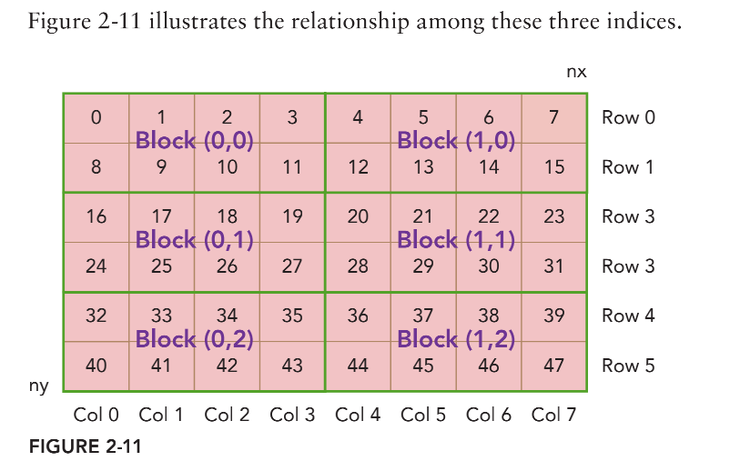
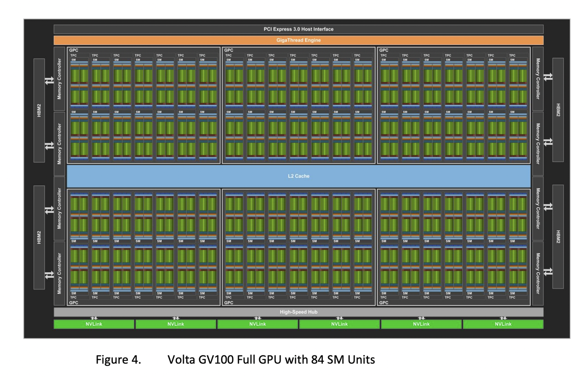
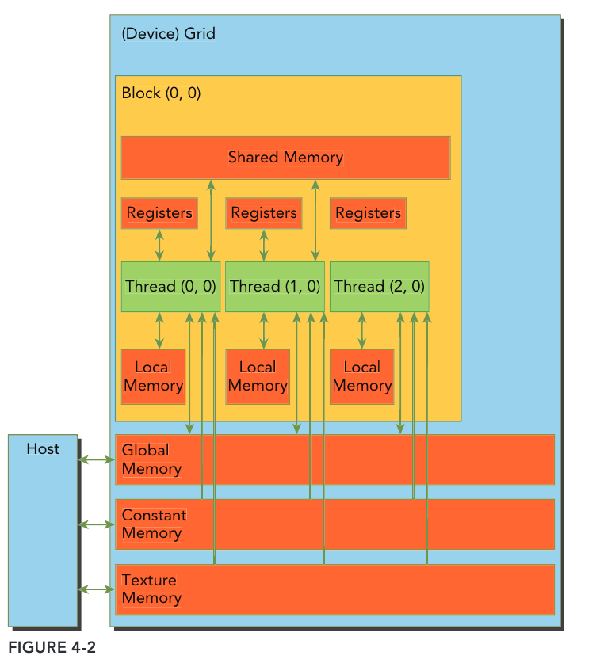

## hello world

我们首先通过hello world来了解cuda这门语言

```c
#include<stdio.h>
​
//定义gpu 核函数
__global__ void helloFromGPU()
{
   printf("Hello World from GPU!\n");
}
int main()
{
    //hello from cpu
    printf("Hello World from CPU!\n");
    //调用核函数
    helloFromGPU<<<1,1>>>();
    cudaDeviceReset();
    return 0;
}
```

接下来运行

```bash
nvcc hello.cu -o hello
./hello
```

我们介绍两个基础知识:

- cuda 显存管理
- cuda 线程管理

显存管理:这部分和c的内存管理差不多

|标准C函数 |CUDA C 函数 |说明           |
|-|-|-|
|malloc |cudaMalloc |在CPU/GPU 申请内存     |
|memset |cudaMemset |为新内存做初始化        |
|memcpy |cudaMemcpy |CPU/GPU之间的数据传输   |
|free |cudaFree |释放CPU/GPU内存        |

线程管理:解释了<<<1,1>>>是什么意思

当核函数在主机端(CPU)启动时,在GPU上执行是会产生大量的线程,cuda采取层级结构(grid->block>thread)来管理这些线程

一个kernal可以对应3个维度的grid;同理block;

```raw
blockIdx : 块在网格中的索引
threadIdx : 线程在块中的索引

blockDim :每个block在三个维度上的线程数（没有用到的维度，维数初始化为1）
gridDim ： 每个grid在三个维度上的块数（没有用到的维度，维数初始化为1）

通过以上4个变量可以确定线程的索引
```

所以说<<<1,1>>>就是说这个kernel对应的grid拓扑为(1,1,1),block对应的block拓扑为(1,1,1)

接下来介绍一下具体如何计算线程的索引

```c
//用代码来描述
//方式1
__device__ int getGlobalIdx_2D_2D_1()
{
    int ix = threadIdx.x + blockIdx.x * blockDim.x;
    int iy = threadIdx.y + blockIdx.y * blockDim.y;
    unsigned int idx = iy*（gridDim.x*blockDim.x） + ix;
    return idx;
}
//方式2
__device__ int getGlobalIdx_2D_2D_2()
{
    int blockId = blockIdx.x + blockIdx.y*gridDim.x;
    int threadId = blockId *(blockDim.x * blockDim.y) + (threadIdx.y*blockDim.x) + threadIdx.x;
    return threadId;
}
```

两种计算方式的区别可以理解为自底向上(方法1)与自顶向下(方法2)

以方法1为例,girdsize=(2,3), blocksize=(4,2),如下图。gridDim=（1，2，3），blockDim=（1，4，2）。对于id=37的thread来说，blockIdx=（0，1，2），threadIdx=（0，1，0）；ix=1+1*4=5，iy=0+2*2=4,idx=4*8+5=37,正确



## 实现一个矩阵加法的CUDA核函数

<details>

<summary>code is here</summary>

```c++
#include<cuda_runtime.h>
#include<iostream>
#include<stdio.h>
#include<sys/time.h>
#define CHECK(call)                     \
{                                       \
    const cudaError_t error = call;     \
    if(error!=cudaSuccess)              \
    {                                   \
        printf("Error: %s:%d",__FILE__,__LINE__);      \
        std::cout<<"code: "<<error<<" ,reason: "<<cudaGetErrorString(error)<<std::endl;     \
        exit(-10*error);     \
    }                        \
}
//使用gettimeofday会获取自1970年1月1日0点以来到现在的秒数
//timeval是一个结构体，其中有成员 tv_sec:秒 tv_usec:微秒
double cpuSecond() {
    struct timeval tp;
    gettimeofday(&tp,NULL);
    return ((double)tp.tv_sec + (double)tp.tv_usec*1.e-6);
}
//初始化数组
void initialData(float *ip,int size)
{
    //generate different seed for random number
    time_t t;
    srand((unsigned)time(&t));
    for(int i=0;i<size;i++)
    {
        ip[i]=i;
    }
}
//hostRef传入CPU端计算的矩阵加法结果，gpuRef传入GPU端计算的矩阵加法结果
//对比争取输出"Arrats match"
void checkResult(float *hostRef,float *gpuRef,const int N)
{
    double epsilon = 1.0E-8;
    bool match=1;
    for(int i=0;i<N;i++)
    {
        if(abs(hostRef[i]-gpuRef[i])>epsilon)
        {
            match=0;
            printf("Arrays do not match");
            printf("host %5.2f gpu %5.2f at current %d\n",hostRef[i],gpuRef[i],i);
            break;
        }
    }
    if(match)
      std::cout<<"Arrats match"<<std::endl;
}
//cpu端计算矩阵加法
void sumMatrixOnHost(float *A,float *B,float *C,const int nx ,const int ny)
{
    float *ia=A;
    float *ib=B;
    float *ic=C;
    for(int iy=0;iy<ny;iy++)
    {
        for(int ix=0;ix<nx;ix++)
        {
            ic[ix]=ia[ix]+ib[ix];
        }
        ia += nx;
        ib += nx;
        ic += nx;
    }
}
//cuda核函数计算矩阵加法
__global__ void sumMatrixOnGPU(float *MatA,float *MatB,float *MatC,int nx,int ny)
{
    //使用前问中的线程全局索引的计算方式
    unsigned int ix = threadIdx.x + blockIdx.x * blockDim.x;
    unsigned int iy = threadIdx.y + blockIdx.y * blockDim.y;
    unsigned int idx = iy*nx + ix;
    if(ix<nx && iy<ny)
    {
        //这种线程的全局索引方式正好是与按行优先的存储的矩阵的索引方式是一致的
        //所以线程的全局索引可以与矩阵中元素的索引很好的对应
        MatC[idx] = MatA[idx] + MatB[idx];
    }
}
int main(int argc,char **argv)
{
    int dev = 0;
    cudaDeviceProp deviceProp;
    //CHECK宏定义检查操作是否正常处理
    CHECK(cudaGetDeviceProperties(&deviceProp,dev));
    printf("Using Device %d: %s\n",dev,deviceProp.name);
    CHECK(cudaSetDevice(dev));
    //set up data size of matrix
    int nx = 1<<14; //16384
    int ny = 1<<14; //16384
    int nxy = nx*ny;
    int nBytes = nxy*sizeof(float);
    printf("Matrix size: nx %d ny %d\n",nx,ny);
    //malloc host memory
    float *h_A,*h_B,*hostRef,*gpuRef;
    h_A = (float*)malloc(nBytes);
    h_B = (float*)malloc(nBytes);
    hostRef = (float*)malloc(nBytes);
    gpuRef = (float*)malloc(nBytes);
    //init data at host side
    double iStart = cpuSecond();
    initialData(h_A,nxy);
    initialData(h_B,nxy);
    double iElaps = cpuSecond() - iStart;
    memset(hostRef,0,nBytes);
    memset(gpuRef,0,nBytes);
    iStart = cpuSecond();
    sumMatrixOnHost(h_A,h_B,hostRef,nx,ny);
    iElaps = cpuSecond() - iStart; //cpu 端耗时
    std::cout<<"sumMatrixOnHost cost "<<iElaps<<"sec\n";
    //malloc device global memory
    //GPU 申请GPU端空间
    float *d_MatA,*d_MatB,*d_MatC;
    cudaMalloc((void**)&d_MatA,nBytes);
    cudaMalloc((void**)&d_MatB,nBytes);
    cudaMalloc((void**)&d_MatC,nBytes);
    //transfer data from host to device
    //数据传输
    cudaMemcpy(d_MatA,h_A,nBytes,cudaMemcpyHostToDevice);
    cudaMemcpy(d_MatB,h_B,nBytes,cudaMemcpyHostToDevice);
    //invoke kernel at host side
    int dimx = 32;
    int dimy = 32;
    //block size = (32,32)
    //也就是每个block中有32*32个线程（结构是二维）
    dim3 block(dimx,dimy);
    //grid size = (512,512)
    //也就是每个grid中有512*512个block （结构是二维）
    dim3 grid((nx+block.x-1)/block.x,((ny+block.y-1)/block.y));
    iStart = cpuSecond();//gpu初始时间
    sumMatrixOnGPU<<<grid,block>>>(d_MatA,d_MatB,d_MatC,nx,ny);//以上述配置线程层级结构的方式启动核函数
    cudaDeviceSynchronize();
    iElaps = cpuSecond() - iStart;
    printf("sumMatrixOnGPU<<<(%d,%d),(%d,%d)>>>elapsed %f sec\n",grid.x,grid.y,block.x,block.y,iElaps);
    //copy kernel result back to host side
    //再把GPU计算的结果拷贝会cpu端
    cudaMemcpy(gpuRef,d_MatC,nBytes,cudaMemcpyDeviceToHost);
    //check device res
    checkResult(hostRef,gpuRef,nxy);
    //释放gpu中申请的内存
    cudaFree(d_MatA);
    cudaFree(d_MatB);
    cudaFree(d_MatC);
    //释放主机端内存
    free(h_A);
    free(h_B);
    free(hostRef);
    free(gpuRef);
    //reset device 
    cudaDeviceReset();
    return (0);
}

```

</details>

我们可以用nsight system看一下kernel/cpu执行的timeline

install in unbuntu

```bash
apt update
apt install -y --no-install-recommends gnupg
echo "deb http://developer.download.nvidia.com/devtools/repos/ubuntu$(source /etc/lsb-release; echo "$DISTRIB_RELEASE" | tr -d .)/$(dpkg --print-architecture) /" | tee /etc/apt/sources.list.d/nvidia-devtools.list
apt-key adv --fetch-keys http://developer.download.nvidia.com/compute/cuda/repos/ubuntu1804/x86_64/7fa2af80.pub
apt update
apt install nsight-systems-cli
```

结果如下

```raw
Using Device 0: NVIDIA GeForce RTX 3090
Matrix size: nx 16384 ny 16384
sumMatrixOnHost cost 0.709849sec
sumMatrixOnGPU<<<(512,512),(32,32)>>>elapsed 0.004298 sec

```

再补充一点nsight的分析

## GPU架构



以v100 Volta架构为例，由以下组成：

- PCI-Express Host Interface : 主机接口用于将 GPU 连接到 CPU
- Giga Thread : 全局调度器，用于将线程块分发给 SM 线程调度器
- 核心部分：6个GPC( GPU Processing Clusters)，每个GPC里面包含7个TPC(Texture Processing Clusters)，每个TPC又包含2个SM(StreamingMultiprocessors)
- L2 Cache：片内所有SM共享
- NVLink ：用于多GPU之间的相互连接
- Memory Controller & HBM2：前者作为内存控制器，用于访问HBM2（GPU全局内存，也就是显存，如V100是16G）

GPU里最重要的就是SM，即流处理器


SM被分为4个子块，所有子块共享L1数据cache、L1指令cache,每个子块又由下列组件组成：

- L0 Instruction Cache (指令缓存)
- Warp Scheduler模块负责warp调度，一个warp由32个线程组成，warp调度器的指令通过Dispatch Units送到Core执行。
- Register File(寄存器)
- 8个FP64 CUDA 核心、16个INT CUDA核心、16个FP32 CUDA核心和2个Tensor核心。
- 8个LD/ST Units负责将值加载到内存或者从内存中加载值
- 1个SFU 用来处理sin、cos、求倒数、开平方特殊函数

## CUDA 执行流程

当启动内核程序时，GPU接受定义的线程层级结构，并**以线程块(block)为单位**将线程块分配给多个SM。一旦线程块被调度到一个SM，线程块中的线程会被进一步划分为线程束(warp)，每个线程束被调度到一个SM子块执行，线程束中的线程被分配到SM子块上的CORE执行（一对一）。一个线程束(warp)是由32个连续的线程组成，在一个线程束中，所有的线程按照单指令多线程`(SIMT)`方式执行，即一个线程束中所有的线程在同一周期中必须执行相同的指令。

> 所以在硬件物理上只有同一线程束中的32个线程是严格并行执行的。同时，正因为硬件总是给一个线程块分配一定数量的线程束，所以在设置内核函数的网格参数(gird)时要尽量保证线程块中线程的数量是线程束中线程数量(32)的整数倍。

> 同一线程束(warp)中的32个线程是严格并行执行相同指令的，如果cuda程序中出现分支(如if)，导致32个线程无法在同一时刻执行相同指令就会出现线程束分化的问题。则只有相同条件的线程会并行执行，其余等待。

- SIMD(单指令多数据)，是指对多个数据进行同样操作。非并发性，一个指令，仅需要宽的ALU和较小的控制逻辑，一次操作多个数据。
- SIMT(单指令多线程)，想象有这样一个多核系统，每一个core有自己的寄存器文件、自己的ALU、自己的data cache，但是没有独立的instruction cache(指令缓存)、没有独立的解码器、没有独立的Program Counter register，命令是从单一的instruction cache同时被广播给多个SIMT core的。即所有的core是各有各的执行单元，数据不同，执行的命令确是相同的。

## cuda 内存结构



1. 寄存器

每个线程私有，数量比CPU的多。当我们在核函数内不加修饰的声明一个变量，此变量就存储在寄存器中，如果一个核函数使用了超过限制的寄存器数量，那么就会用Local memory来帮忙，这称之为寄存器溢出。

声明周期和核函数一致，从开始运行到运行结束，执行完毕后，寄存器就不能访问了。

2. Local memory

存放每个线程寄存器溢出的变量

3. share memory

在核函数中使用如下修饰符的内存，称之为共享内存：
**share**

每个SM都有一定数量的由线程块分配的共享内存，共享内存跟主存相比，速度要快很多，类似于L1 cache，但是可以被编程。

- 使用共享内存的时候一定要注意，不要过度使用共享内存，如果一个线程块使用的共享内存过多，会导致更多的线程块没办法被SM启动，这样影响活跃的线程束数量。
- 共享内存是线程之间相互通信的基本方式，要避免内存竞争

4. constant memory

- 常量内存必须在全局空间内和所有核函数之外进行声明
- 每从一个常量内存中读取一次数据，都会广播给线程束里的所有线程

5. texture memory

图形相关，忽略

6. global memory

GPU上最大的内存空间，延迟最高，使用最常见的内存

一个全局内存变量可以被静态声明或动态声明。
动态声明就是前面讲过的cudaMalloc的方式，静态声明要使用__device__来修饰
