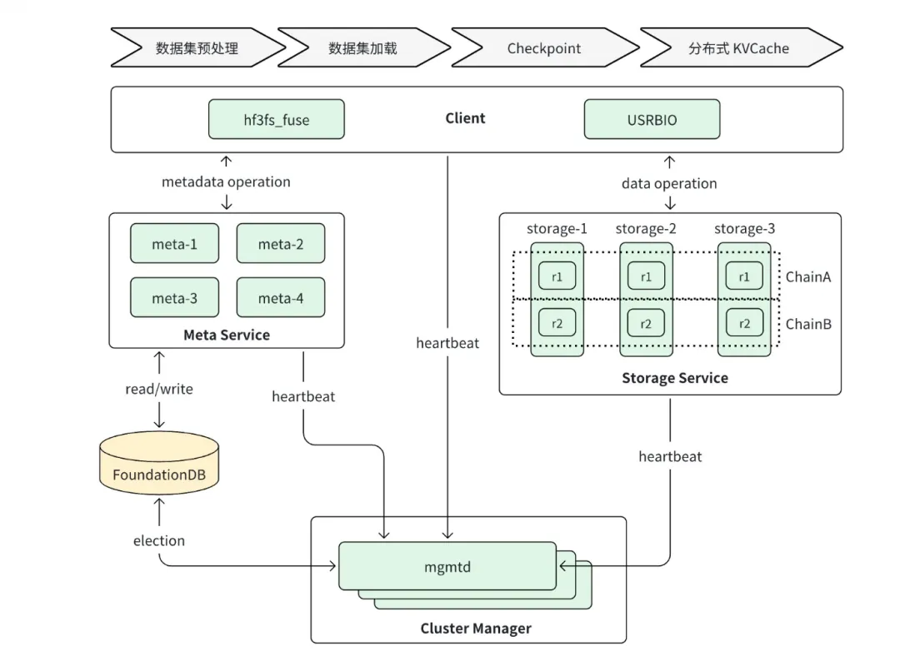
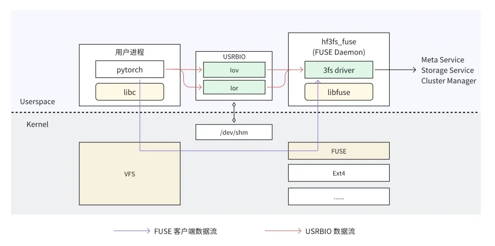

2019年就已发布。简而言之3FS是充分利用
现代固态硬盘（SSD）和远程直接内存访问（RDMA）网络带宽的一种并行文件系统。
专门针对训练进行优化：优化读带宽的优化，而放松对写性能、元数据性能的要求

> 根据官方的话来说(2022年)：它几乎只用在AI训练时计算节点中的模型批量读取样本数据这个场景上，
> 通过高速的计算存储交互加快模型训练。这是一个**大规模的随机读取任务**，而且读上来的
> 数据不会在短时间内再次被用到，因此我们无法使用**读取缓存**这一最重要的工具来优化文件
> 读取，即使是超前读取也是毫无用武之地。

在开源周的时候场景显然拓展：全面支持V3/R1的训练数据预处理、数据集加载、检查点保存/重载、RAG搜索和KVCache查询推理(成本效益高的DRAM缓存替代方案)

硬件上来说，场景包含：3FS文件系统、高速交换机、与客户端。
每个存储服务节点有16张各15TB的SSD硬盘和2张RDMA网卡，宽带强大。
存储节点与计算节点（Clients）通过800口高速交换机进行连接,
一个交换机需要连接数百个计算节点，每个计算节点分到的带宽有限。

架构设计：3FS 整个系统由四个部分组成，分别是Cluster Manager、Client、Meta Service、Storage Service。
- Cluster Manager：管理集群配置信息，处理成员变更同步给客户端和其他服务；在运行时，metadata service和storage service向Cluster manager发送心跳，集群管理器通过监听信息来检测服务状态
- Storage service：负责数据的持久化，实际存数据的地方
- Meta Service使用FoundationDB存储。元数据的分布式一致性交给 FoundationDB 负责即可。FoundationDB是苹果公司开源的分布式Key-Value数据库
- Client 分为 fuse client 和 native client 两种。fuse client 更为通用，但性能受限于 fuse 框架。client支持连接任意的meta service，根据获取到的信息找到相应的storage server，执行相应的IO操作。

核心设计：
1. 存算分离设计让SSD和网卡带宽实现线性扩展
2. Storage Service中每个数据3副本存储，使用链式复制协议CRAQ，对读取更友好
3. native client
4. rdma传输size 对齐优化
5. 关注读取，trade-off

用户使用3FS非常简单，只需要将样本数据转化成FFRecord格式，存入3FS中即可。
适配了 PyTorch 的 Dataset 和 Dataloader 接口，可以非常方便的加载发起训练。

数据：180个存储节点6.6TiB/s的聚合读取速度，强一致

else: 
- fire-Flyer AI-HPC: A Cost-Effective Software-Hardware Co-Design for Deep Learning paper
- To FUSE or Not to FUSE: Performance of User-Space File Systems: https://www.usenix.org/system/files/conference/fast17/fast17-vangoor.pdf
- Combining Buffered I/O and Direct I/O in Distributed File Systems: https://www.usenix.org/conference/fast24/presentation/qian
- Rethinking the Request-to-IO Transformation Process of File Systems for Full Utilization of High-Bandwidth SSDs: https://www.usenix.org/conference/fast25/presentation/zhan
